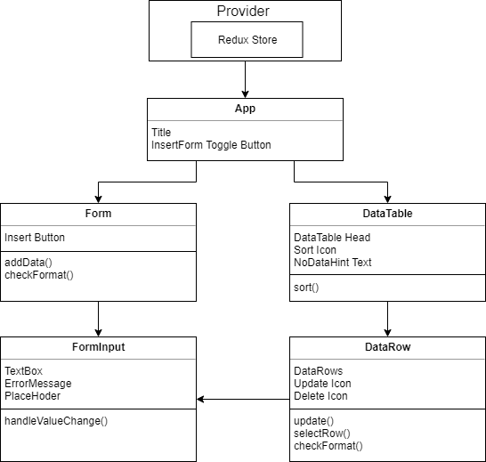

# CRUD - DATA - TABLE
[Demo]( https://shinenic.github.io/crud-data-table/ )

預設載入固定資料五筆，

可透過新增、修改、刪除、排序來操作資料的網頁應用程式。


# 功能

* insert
  * 輸入資料後按下 "insert" 便會在資料無誤下新增 data
  * 手機模式下可透過點選 "+" 隱藏 / 顯示輸入框
  * 輸入框具有提示 "格式錯誤"、"未輸入" 的檢查功能
* update
  * 透過點選資料欄的修改圖標，更新 data 內容
  * 輸入框具有提示 "格式錯誤"、"未輸入" 的檢查功能
* delete
  * 透過點選資料欄的移除圖標，刪除 data 
* sort
  * 點擊排序圖標來改變排序規則


# 使用技術

* React
* Redux
* Jest 
* Enzyme
* SCSS
* RWD

# 使用

## 安裝套件
```
npm install
```

### 執行
```
npm start
```


### 測試 (詳細結果)

```
npm test -- --verbose
```

# 設計架構

## 元件架構



## 單元測試


